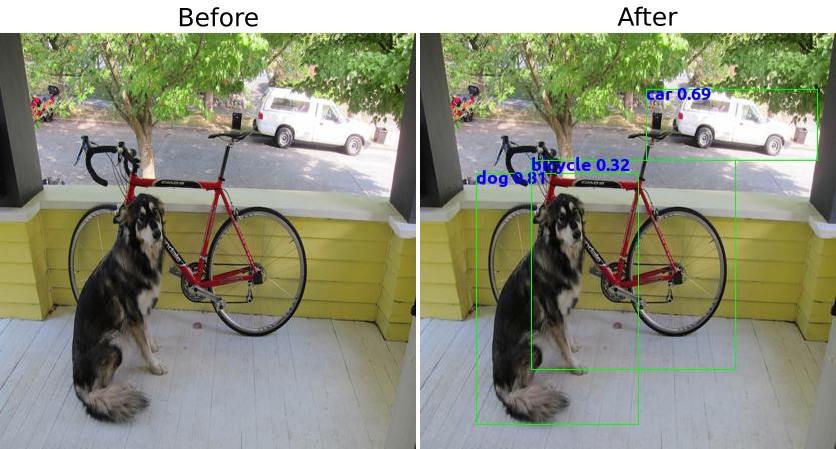

# Tiny-Yolo-3
Google Colab Notebook for creating and testing a Tiny Yolo 3 real-time object detection model. This notebook manually creates the Tiny Yolo 3 model layer by layer allowing it to be customized for the constraints of your hardware. This notebook can be run to create an .h5 file that can be downloaded from the notebook.

Like/Follow the [Black Magic AI Facebook page](www.facebook.com/Black-Magic-AI-109126344070229)
for the latest post about this project and others.

## Reference

	@article{YOLOv3,  
	  title={YOLOv3: An Incremental Improvement},  
	  author={J Redmon, A Farhadi },
	  year={2018}
    url={https://pjreddie.com/media/files/papers/YOLOv3.pdf}

Redmon, Joseph. “Yolo Web: Real-Time Object Detection.” YOLO: Real-Time Object Detection, Joseph Redmon, 2018, pjreddie.com/darknet/yolo/.

Based on code from
Xiaochus, Larry. “YOLOv3” Github code, Xiaochus, Larry, 2018, https://github.com/xiaochus/YOLOv3.
